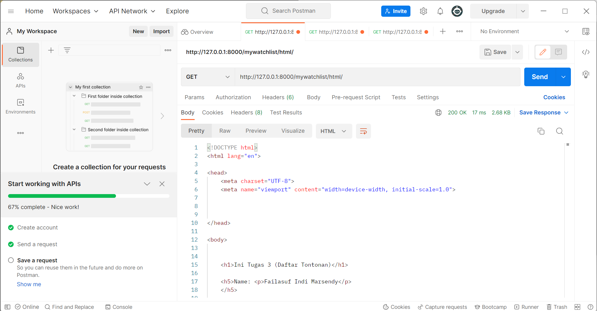
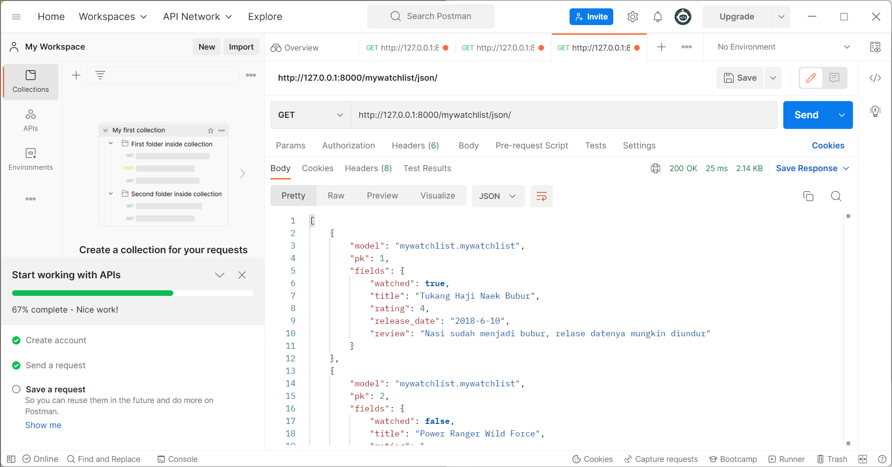
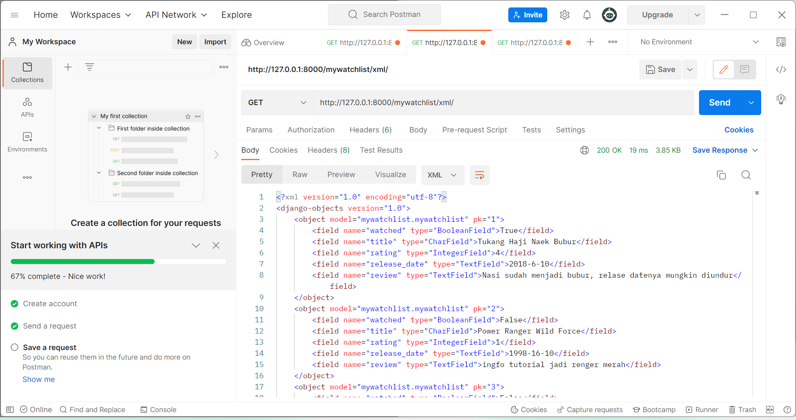

Link Heroku : https://mytugas2pbpkatalog.herokuapp.com/mywatchlist/html/

1. Html merupakan pembuatan kerangka dari user interface yang menyajikan tampilan
   dari program yang dibuat, sedangkan JSON dan XML dapat digunakan untuk menyimpan 
   elemen, namun keduanya terdapat perbedaan. JSON akan menyimpan elemen secara efisien
   namun dengan tampilan yang kurang rapi, sedangkan XML akan ditampilkan secara lebih terstruktur
   dan mudah dibaca oleh manusia dan mesin, akan tetapi XML kurang efisien.
   HTML akan memplotkan bagian-bagian seperti tamplate yang akan ditampilkan kepada user,
   sedangkan data dapat ditampilkan dalam bentuk xml mapun json.

 2. Dalam sebuah platform terdapat interaksi antara user dengan platform tersebut, Platform akan mewadahi aktivias yang diinginkan oleh user dalam memakai fasilitas user. Untuk memfasilitasi hal tersebut dilakukan data delivery sehingga dapat merubah data, mengganti data, menerima data, dan sebagainya sesuai interkasi user. Data delivery akan menkoneksikan hal tersebut, yang mana proses pengantaran data akan sesuai apa yang diinginkan oleh user. Tanpa adanya data delivery interaksi antara user dengan program akan berjalan pasif karena tidak ada data yang dikirimkan.

3. cara kamu mengimplementasikan Program
• Pertama kita membuat sebuah app yaitu mywatchlist, kemudian kita lakukan pendaftaran Django-app pada INSTALLED_APPS yang ada pada setting.py di folder project_django. 
• Buat sebuah class pada model.py pada folder mywatchlist yaitu class MyWatchList yang memiliki 5 atribut yaitu watched, title, rating, release_date, dan review.
• Setelah itu kita membuat folder fixture yang berisi file json yang berisi data yang telah disesuaikan dengan tiap-tiap atribut pada class MyWatchList
• views.py dengan membuat  fungsi yaitu show_mywatchlist untuk menayangkan file html.
• Membuat file html berdasarkan fungsi tersebut, dimana kita membuat table yang isinya adalah data dari json yang kita tayangkan dengan melakukan iterasi.
• Kita juga harus menambahkan folder urls.py pada folder mywatchlist, dan menghubungkan urls untuk tampilan dari browser yang diambil dari views.py
• Kemudian kita melakukan pengambilan data base dari file json yang telah dibuat, dengan mengimport class dari model pada file app. Kita membuat sebuah maps yang berisi nama, npm dan data yang kita ambil dari models. Kemudian kita render maps tersebut bersamaan dengan file html yang telah dibuat
• Pada views.py kita melakukan import terhadap HttpResponse dan Serializer, kemudian kita membuat 3 fungsi lainya yaitu show_xml untuk menayangkan data xml, dan show_json untuk menayangkan data json, dan show_json_by_id. Kemudian kita melakukan return

